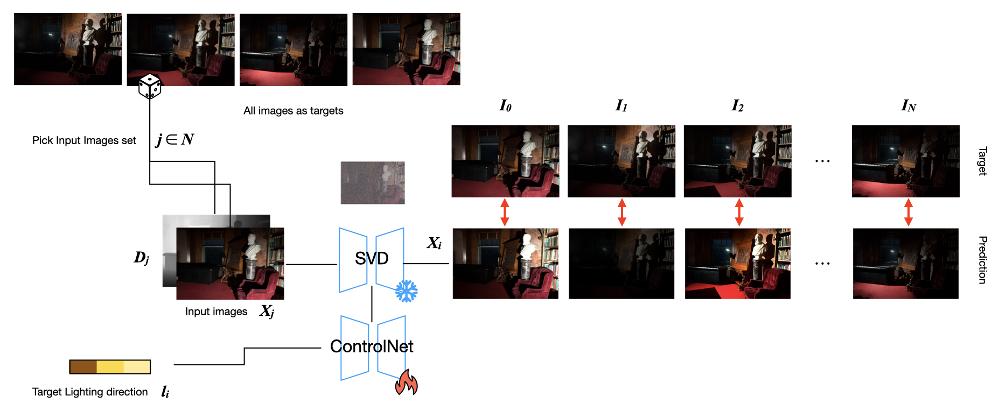
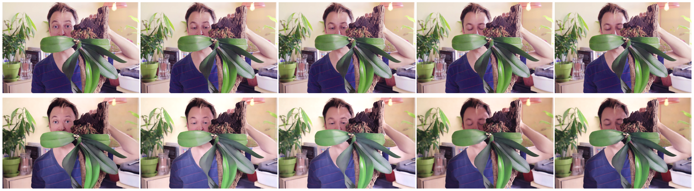

# Stable Video Diffusion Temporal Controlnet for Video Relighting

## Overview
Introducing the Stable Video Diffusion Temporal Controlnet for Video Relighting!
This tool uses a ControlNet style encoder with the Stable Video Diffusion base. It's designed to enhance your video diffusion projects by providing precise lighting control.



## Setup
- **Controlnet Model:** you can get the depth model by running the inference script, it will automatically download the depth model to the cache, the model files can be found here: [temporal-controlnet-depth-svd-v1](https://huggingface.co/CiaraRowles/temporal-controlnet-depth-svd-v1)
- **Installation:** run 
```
conda env create -f environment.yml
git submodule init
git submodule update
```
## Demo



## Training
My example training config is configured like this:
```
CUDA_VISIBLE_DEVICES=0 accelerate launch train_svd_controlnet.py \
 --pretrained_model_name_or_path="stabilityai/stable-video-diffusion-img2vid" \
 --output_dir="/fs/nexus-scratch/sjxu/Model_out/model_out" \
 --csv_path="/fs/nexus-scratch/sjxu/WebVid/blender.csv" \
 --video_folder="/fs/nexus-scratch/sjxu/WebVid/blender/img" \
 --condition_folder="/fs/nexus-scratch/sjxu/WebVid/blender/shd" \
 --motion_folder="/fs/nexus-scratch/sjxu/WebVid/blender/motion" \
 --validation_image_folder="/fs/nexus-scratch/sjxu/svd-temporal-controlnet/validation_demo/img_blender" \
 --validation_control_folder="/fs/nexus-scratch/sjxu/svd-temporal-controlnet/validation_demo/shd_blender" \
 --width=512 \
 --height=512 \
 --learning_rate=2e-5 \
 --per_gpu_batch_size=4 \
 --num_train_epochs=5 \
 --mixed_precision="fp16" \
 --gradient_accumulation_steps=4 \
 --checkpointing_steps=2000 \
 --validation_steps=200 \
 --gradient_checkpointing \
 --num_train_epochs 1000 \
 --checkpoints_total_limit=1 \
 --report_to="wandb" \
 --dropout_rgb=0.1 \
 --sample_n_frames=5 \
 --num_frames=5 \
```
decoder training
```
CUDA_VISIBLE_DEVICES=0 accelerate launch train_svd_decoder.py \
 --output_dir="/fs/nexus-scratch/sjxu/Model_out/decoder" \
 --width=512 \
 --height=512 \
 --learning_rate=1e-4 \
 --per_gpu_batch_size=2 \
 --num_train_epochs=30 \
 --mixed_precision="bf16" \
 --gradient_accumulation_steps=8 \
 --checkpointing_steps=500 \
 --validation_steps=200 \
 --gradient_checkpointing \
 --checkpoints_total_limit=5 \
 --report_to="wandb" \
 --num_workers=4 \
 --mse_weight=0.4

```
## Inference

inference
```
python eval_svd_controlnet.py \
 --validation_image_folder="/fs/nexus-scratch/sjxu/controlnet-diffusers-relighting/exemplars/" \
 --output_dir="/fs/nexus-scratch/sjxu/svd-temporal-controlnet/output" \
 --concat_depth_maps \
 --width=512 \
 --height=512 \
 --mixed_precision="bf16" \
 --target_light='23, 0, 1, 18, 19' \
 --num_frames=5 \
```


## Acknowledgements
- **lllyasviel:** for the original controlnet implementation
- **Stability:** for stable video diffusion.
- **Diffusers Team:** For the svd implementation.
- **Pixeli99:** For providing a practical svd training script: [SVD_Xtend](https://github.com/pixeli99/SVD_Xtend)
- **Stable Video Diffusion Temporal Controlnet** For providing the foundation SVD temporal ControlNet code base  [Code](https://github.com/CiaraStrawberry/svd-temporal-controlnet/)
- **Controlnet Diffusers Relighting** For providing the image-based SD ControlNet relighting code  [Code](https://github.com/graphdeco-inria/controlnet-diffusers-relighting/)
